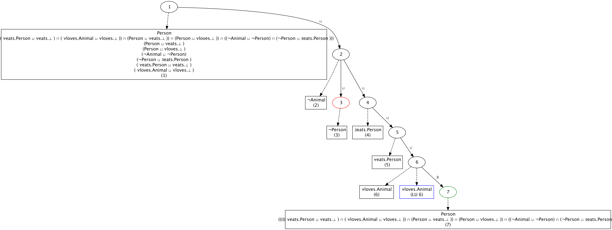

# ALC Concept Satisfiability Inference Engine

This project implements an inference engine for checking the satisfiability of a concept in the ALC logic. The engine leverages the **Tableau method** and incorporates optimizations such as **Blocking** and **Lazy Unfolding** to efficiently determine satisfiability. The user interacts with the engine through a graphical interface, providing the concept and TBox as inputs, and receives results both graphically and textually.

  
  
<em>graph representation of the tableau</em>

The tableau resulting from the query is graphically represented in RDF format (Turtle notation) and visualized with a specific graph visualization program (graphviz).

## Features
- **Graphical User Interface (GUI):** Users can input the concept either by typing directly or by importing it from a file.
- **TBox Handling:** The TBox is loaded from an OWL serialized file (preferably in Manchester syntax) and is used to verify the satisfiability of the provided concept.
- **Inference Process:** The Tableau-based reasoning process checks whether the given concept is satisfiable concerning the provided TBox.
- **Result Output:** The resulting tableau is saved in both **.rdf** (Turtle syntax) and **.png** format. Additionally, the console shows the translated concept, satisfiability status, and execution time.

## Input

- Concept (C): Input via GUI as Manchester syntax or imported from a file.
- TBox (T): Serialized OWL file in Manchester syntax, placed in the **`ontologies/`** directory. 

The engine uses Tableau-based reasoning to verify satisfiability in the ALC logic, incorporating the following techniques:

## Key Features

### Blocking
Prevents the exploration of redundant branches in the tableau by ensuring that a node’s label is checked against its ancestors to detect equivalence.
Optimized using parent references for fast ancestor traversal and condition checks on class assertions.

### Lazy Unfolding
Delays the expansion of certain axioms (like equivalences and subclass assertions) until necessary, improving performance.
Axioms are partitioned into unfoldable and non-unfoldable subsets, and the unfolding is applied lazily during the tableau expansion.
